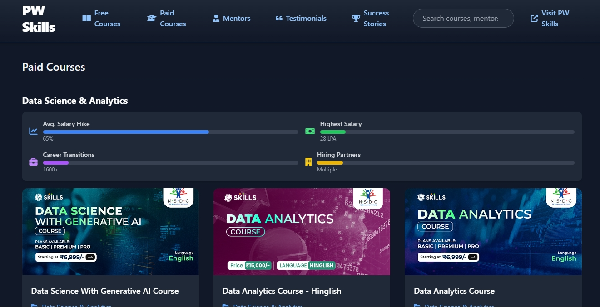

# PW Skills Courses Platform


Welcome to the **PW Skills Courses Platform**, a dynamic and responsive web application showcasing free and paid courses, mentors, testimonials, success stories, and hiring partners from PW Skills. Built with modern web technologies, this project delivers an engaging, accessible, and user-friendly experience for exploring educational content.

## 🚀 Features

- **Responsive Navigation**: Mobile-friendly navigation with smooth animations, dropdown menus, and a hamburger menu for smaller screens.
- **Course Listings**: Displays free and paid courses with metadata like duration, enrollment count, and registration status (open/closed).
- **Enhanced Course Meta**: Progress bars and tooltips for average salary hikes, highest salaries, career transitions, and hiring partners.
- **Mentor Profiles**: Detailed mentor cards with social links, company logos, and experience details (work and teaching).
- **Testimonials & Success Stories**: Interactive carousel for success stories and grid-based testimonials with rich details.
- **Hiring Partners**: Grid-based display of partner company logos with hover effects.
- **Search & Filter**: Real-time search across courses, mentors, and testimonials, with category filtering for paid courses.
- **Dark Theme**: Modern dark-themed UI with smooth transitions, gradients, and animations powered by Tailwind CSS and Animate.css.
- **API Integration**: Fetches data from PW Skills APIs (`https://api.pwskills.com/v2/course/revampedHome` and `https://api.pwskills.com/v2/course/list-categories`) with caching for performance.
- **Accessibility**: ARIA labels, screen reader support, and keyboard navigation for inclusive user experience.
- **Footer**: Comprehensive footer with quick links, contact details, social media links, and dynamic copyright year.

## 🛠️ Tech Stack

- **HTML5**: Semantic markup for accessibility and structure.
- **CSS3 (Tailwind CSS)**: Utility-first CSS framework for responsive, modern styling with custom gradients and animations.
- **JavaScript**: Dynamic functionality, API fetching, DOM manipulation, and smooth scrolling.
- **Font Awesome**: Icons for enhanced visual appeal.
- **Animate.css**: Smooth animations for cards, transitions, and carousels.
- **DOMPurify**: Sanitizes API data to prevent XSS attacks.
- **API**: Integrates with PW Skills APIs for dynamic content.

## 📂 Project Structure

```plaintext
├── index.html          # Main HTML file with navigation, course meta, and footer
├── README.md           # Project documentation (this file)
├── index.css           # CSS Stylesheet file
└── index.js            # JavaScript file
```

## 📸 Screenshots

| Desktop View | Mobile View |
|--------------|-------------|
|  |  |

## 🏁 Getting Started

### Prerequisites

- A modern web browser (Chrome, Firefox, Safari, etc.)
- Internet connection for API data fetching
- Optional: Local server (e.g., Live Server extension for VS Code) for development

### Installation

1. **Clone the Repository**:
   ```bash
   git clone https://github.com/thegitguru/pw-skills-clone.git
   ```

2. **Navigate to the Project Directory**:
   ```bash
   cd pw-skills-clone
   ```

3. **Open the Project**:
   - Open `index.html` in a web browser directly, or
   - Use a local server for a better development experience:
     ```bash
     npx live-server
     ```

### Dependencies

The project uses CDN-hosted dependencies:
- [Tailwind CSS](https://cdn.tailwindcss.com)
- [Font Awesome](https://cdnjs.com/libraries/font-awesome)
- [Animate.css](https://cdnjs.com/libraries/animate.css)
- [DOMPurify](https://cdnjs.com/libraries/dompurify)

No additional installation is required for these dependencies.

## 🎮 Usage

1. **Explore Courses**:
   - Navigate to "Free Courses" or "Paid Courses" using the top navigation menu.
   - Use the search bar to find specific courses, mentors, or testimonials.
   - Filter paid courses by category using the filter buttons with category icons.

2. **View Mentors & Testimonials**:
   - Browse mentor profiles with company logos, social links, and experience details.
   - Read testimonials and success stories in dedicated sections, with a carousel for success stories.

3. **Mobile Experience**:
   - On mobile devices, tap the hamburger menu to access the slide-in navigation with smooth animations.
   - Dropdown menus and search input are optimized for touch interactions.

4. **API Data**:
   - Fetches course, category, mentor, and testimonial data on load with skeleton loaders for a smooth UX.
   - Cached data (1-hour expiration) is used if the API is unavailable.

5. **Footer Navigation**:
   - Access quick links, contact details, and social media profiles (LinkedIn, YouTube, Telegram) in the footer.
   - Smooth scrolling for footer links enhances navigation.

## 🤝 Contributing

Contributions are welcome! To contribute:

1. **Fork the Repository**:
   Click the "Fork" button on GitHub to create your own copy.

2. **Make Changes**:
   Implement features or bug fixes, ensuring code quality and consistency.

3. **Test Locally**:
   Verify changes in multiple browsers and test API integration with fallback behavior.

4. **Submit a Pull Request**:
   Push changes and open a pull request with a clear description.

### Contribution Guidelines

- Follow the existing code style (use Prettier for formatting if possible).
- Ensure responsiveness across desktop and mobile devices.
- Test accessibility features (ARIA labels, keyboard navigation).
- Verify API integration and caching functionality.
- Update this README if new features or dependencies are added.

## 📜 License

This project is licensed under the [MIT License](LICENSE).

## 📬 Contact

For questions or feedback, reach out via:
- **GitHub Issues**: [Open an issue](https://github.com/thegitguru/pw-skills-clone/issues)

## 🙌 Acknowledgments

- [PW Skills](https://pwskills.com) for the API and inspiration.
- [Tailwind CSS](https://tailwindcss.com) for utility-first styling.
- [Font Awesome](https://fontawesome.com) for icons.
- [Animate.css](https://animate.style) for animations.
- [DOMPurify](https://github.com/cure53/DOMPurify) for secure data sanitization.
- Designed with ❤️ by [Aryan Verma](https://github.com/thegitguru).

---

⭐ **Star this repository if you find it useful!** ⭐
